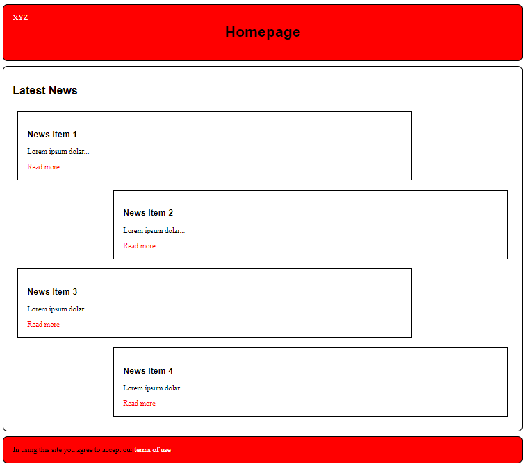

# CSS Best Practices

## Identifying bad practices
* Download and unzip this repository (click the big green button)
* Open the HTML and CSS in a text editor
* Don't make any changes to the HTML
* Add CSS rules that will do the following:
    1. Make the *div* with an id of 'news4' fit the styling of the other news posts. It will need to be floated to the right like the second news item, and appear beneath the third news item.
    2. Give the footer a red background, margin of 10px, padding of 20px and a solid rounded border (10px radius).
    3. Change the colour of the hyperlink in the footer so it is visible (white).
    
    Have a look at the following screenshot which shows what the final page should look like:
    
    
* How DRY do you think the CSS is? Specifically what do you think the problems are? 
* How could the CSS and HTML be re-written to avoid these problems? 

## Re-writing the CSS
* Make a copy of the final working design.
* Using this copy re-write the CSS (and possibly the HTML) to make it more maintainable. 

# Thinking about BEM
A  widely used technique to improve the maintainability of CSS is the BEM naming convention. Before attempting the following please familiarise yourself with BEM - [https://getbem.com/introduction/](https://en.bem.info/methodology/quick-start/).

To practice these ideas have a look at https://courses.hud.ac.uk/2023-24/full-time/undergraduate/information-technology-bsc-hons.  

Think about the type of class names you would have in the CSS for this page if you used BEM. Try to identify which parts of the UI would be blocks, which parts would be elements, and how you would use modifiers.

You don't need to write any CSS, simply draft out a CSS file using selectors with the BEM naming convention e.g.

```css
.header{

}
.header__back-link{

}
...
```

More info
* https://csswizardry.com/2013/01/mindbemding-getting-your-head-round-bem-syntax/
* https://www.smashingmagazine.com/2016/06/battling-bem-extended-edition-common-problems-and-how-to-avoid-them/   
* https://seesparkbox.com/foundry/bem_css_organization
* https://seesparkbox.com/foundry/bem_by_example

